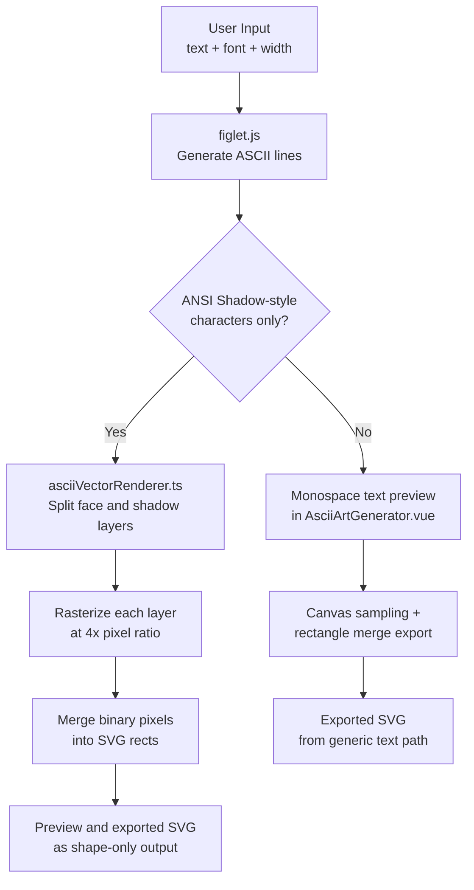

# ASCII Art SVG Generator

A Vue 3 app for turning text into ASCII art and exporting the result as SVG. It supports 295 FIGlet fonts, dynamic font loading, width controls, and two export/rendering paths: a generic text pipeline for most fonts and a dedicated vector pipeline for ANSI Shadow-style output.

## Features

- Real-time ASCII art generation from text input
- 295 FIGlet font styles with on-demand loading
- Quick font switching with arrow keys and Previous/Next buttons
- Five character width modes for spacing control
- Dedicated ANSI Shadow vector rendering for a more unified block look
- Shape-only SVG export for ANSI Shadow-like output, avoiding downstream font substitution in tools such as Figma
- Generic SVG export path for all other FIGlet fonts
- Responsive preview area with font load status indicators

## Rendering Architecture

All font styles share the same generation step. The rendering/export layer branches only after FIGlet produces the ASCII text.



## ANSI Shadow Vector Mode

The dedicated vector mode is content-based rather than font-name-based. It activates only when the generated ASCII output is composed of:

- `█` for the solid face
- `╔═╗║╚╝` for the outline/shadow layer

When that condition is met, the app:

1. Splits the ASCII output into face and shadow layers.
2. Rasterizes both layers separately into binary maps.
3. Bridges tiny gaps in the face layer to reduce visible seams.
4. Merges occupied pixels into SVG `<rect>` shapes.
5. Combines both layers into a font-independent SVG for preview and export.

This keeps the front glyph mass intact, preserves the ANSI Shadow-style shadow geometry better than plain text rendering, and avoids missing-font warnings in design tools.

## Export Modes

- **Generic FIGlet fonts**: preview as raw monospace text and export through canvas sampling plus rectangle merging.
- **ANSI Shadow-like output**: preview and export through `src/utils/asciiVectorRenderer.ts`, producing layered shape-based SVG.

## Directory Structure

```text
ascii-art-svg/
├── AGENTS.md
├── CLAUDE.md
├── README.md
├── public/
│   └── favicon.ico
├── src/
│   ├── assets/
│   │   ├── base.css
│   │   ├── logo.svg
│   │   └── main.css
│   ├── components/
│   │   ├── AsciiArtGenerator.vue
│   │   ├── HelloWorld.vue
│   │   ├── TheWelcome.vue
│   │   ├── WelcomeItem.vue
│   │   └── icons/
│   │       ├── IconCommunity.vue
│   │       ├── IconDocumentation.vue
│   │       ├── IconEcosystem.vue
│   │       ├── IconSupport.vue
│   │       └── IconTooling.vue
│   ├── router/
│   │   └── index.ts
│   ├── stores/
│   │   └── counter.ts
│   ├── types/
│   │   └── figlet-fonts.d.ts
│   ├── utils/
│   │   ├── asciiVectorRenderer.ts
│   │   └── fontLoader.ts
│   ├── views/
│   │   ├── AboutView.vue
│   │   └── HomeView.vue
│   ├── App.vue
│   └── main.ts
├── env.d.ts
├── eslint.config.ts
├── index.html
├── package-lock.json
├── package.json
├── tailwind.config.js
├── tsconfig.app.json
├── tsconfig.json
├── tsconfig.node.json
└── vite.config.ts
```

## Technologies Used

- **Vue 3** with the Composition API
- **Vite** for development and build tooling
- **TypeScript** for typed application code
- **Tailwind CSS** for styling
- **figlet.js** for ASCII art generation
- **HTML5 Canvas** as an intermediate rasterization step for SVG shape extraction

## Getting Started

### Prerequisites

- Node.js 18+
- npm

### Installation

```sh
git clone https://github.com/jeejeeguan/ASCII-ART_SVG.git
cd ASCII-ART_SVG/ascii-art-svg
npm install
```

### Run the App

```sh
npm run dev
```

Then open `http://localhost:5173`.

## Usage

1. Enter the text you want to transform.
2. Pick a FIGlet font from the dropdown.
3. Adjust the character width mode if needed.
4. Use `↑` / `↓` to move through fonts quickly.
5. Export the current result as SVG.

## Character Width Options

- **Full**: maximum spacing
- **Fitted**: tighter spacing
- **Controlled Smushing**: rule-based overlap
- **Universal Smushing**: more aggressive overlap
- **Default**: standard FIGlet layout

## Development Commands

```sh
npm run dev
npm run build
npm run type-check
npm run lint
npm run format
npm run preview
```

## License

This project is licensed under the MIT License.
